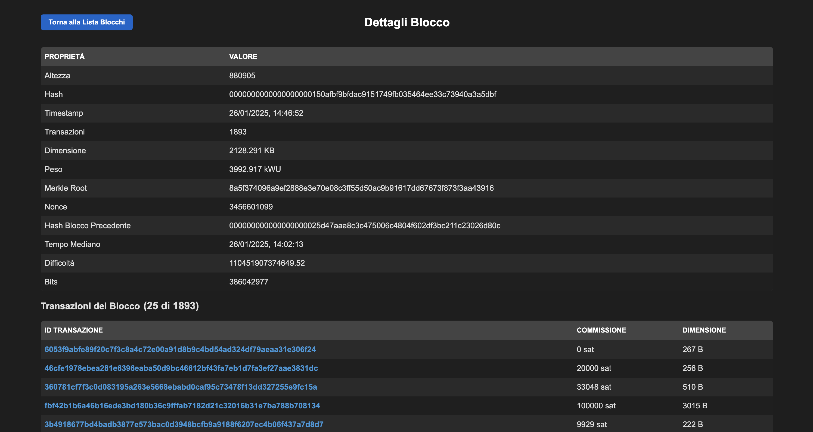
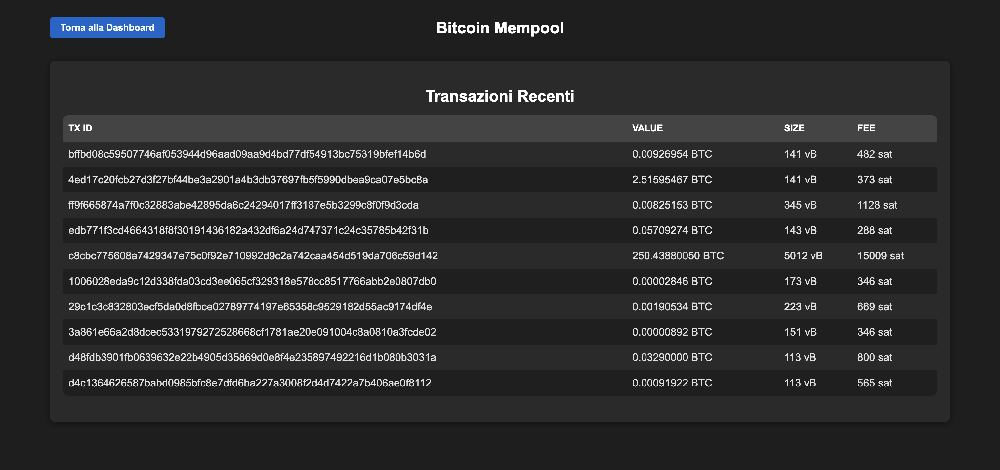

# IoT-Project

## Indice

1. [Introduzione](#introduzione)
2. [Funzionalità del Sito](#funzionalità-del-sito)
3. [Screenshot e Report di Funzionamento](#screenshot-e-report-di-funzionamento)
4. [Teoria della Blockchain](#teoria-della-blockchain)
   - [Blocchi](#blocchi)
   - [Mempool](#mempool)
   - [Nodi](#nodi)
   - [Miners](#miners)
5. [Dettagli dei Blocchi e delle Transazioni](#dettagli-dei-blocchi-e-delle-transazioni)
   - [Dettagli del Blocco](#dettagli-del-blocco)
   - [Dettagli della Transazione](#dettagli-della-transazione)
6. [Conclusioni](#conclusioni)

---

## Introduzione

Il progetto **Blockchain Explorer** è una semplice applicazione web che consente di esplorare e visualizzare la struttura della blockchain di Bitcoin, permettendo agli utenti di osservare informazioni dettagliate sui blocchi e sulle transazioni. L'applicazione è strutturata per dare una comprensione pratica del funzionamento della blockchain, offrendo un'interfaccia utente per esplorare blocchi e la mempool, caratterizzata da transazioni non verificata, nonché interagire con i dati in tempo reale.

### Scopo del Progetto
Lo scopo di questo progetto è duplice:
1. Fornire una comprensione visiva del funzionamento di Bitcoin tramite l'esplorazione di blocchi e transazioni.
2. Offrire una base per comprendere la struttura dei dati di una blockchain, il suo consenso distribuito, e come le transazioni siano validate dai nodi e miners.

---

## Funzionalità del Sito

La pagina principale dell'applicazione mostra la possibilità di scelta se visualizzare i blocchi o la mempool.

### 1. Visualizzazione dei Blocchi

La pagina "blocks" mostra la lista di blocchi recenti della blockchain di Bitcoin. Ogni blocco è corredato da informazioni basilari come l'ID, l'altezza, il numero di transazioni, la dimensione e il peso. Ogni elemento della lista è cliccabile e porta all'interfaccia di dettaglio del blocco.

### 2. Dettagli di un Singolo Blocco

Se un utente seleziona un blocco, viene portato alla pagina del dettaglio, che mostra informazioni complete riguardanti il blocco, comprese informazioni specifiche come:
- L'altezza del blocco
- L'ID del blocco
- Il timestamp di creazione
- Il numero di transazioni incluse
- La dimensione e il peso del blocco
- Il Merkle Root
- Il nonce utilizzato
- Il hash del blocco precedente: se cliccato porta al dettaglio del blocco.
- Lista delle transazioni: Transazioni inserite dentro il blocco e dunque confermate. Se cliccate porta al dettaglio della transazione.

### 3. Visualizzazione delle Transazioni

La pagina "mempool" mostra la lista di tutte le transazioni più recenti presenti all'interno della mempool, sono caratterizzate da diverse informazioni come l'ID, il valore, la dimensione e la fee.

### 4. Dettagli della Transazione

Ogni transazione all'interno di un blocco è anch'essa cliccabile e porta alla pagina di dettaglio della transazione, che include informazioni come:
- ID della transazione
- Lo stato della transazione (confermata/non confermata)
   - *Se confermata:*
      - Blocco Confermato: se cliccato porta al dettaglio del blocco.
      - Altezza Blocco
- La data della transazione (se confermata)
- La commissione pagata
- La dimensione della transazione
- La versione della transazione
- Il locktime

---

## Screenshot e Report di Funzionamento

---

## Teoria della Blockchain

### Blocchi

Un **blocco** nella blockchain è una struttura dati che contiene un insieme di transazioni, un nonce e l'hash del blocco precedente. Ogni blocco è identificato univocamente tramite un hash. I blocchi sono concatenati in ordine cronologico, con ogni blocco che contiene il **hash del blocco precedente**, creando una catena immutabile. I blocchi sono creati dai **miner** e validati dai **nodi**.

### Mempool

La **mempool** (memory pool) è una zona di memorizzazione temporanea dove vengono conservate le transazioni che non sono ancora state incluse in un blocco. Le transazioni vengono aggiunte alla mempool quando sono create e, successivamente, vengono raccolte dai miner per essere incluse nel prossimo blocco valido.

### Nodi

I **nodi** sono dispositivi (computer, server o sistemi embedded) che partecipano alla rete blockchain. Ogni nodo mantiene una copia della blockchain, valida le transazioni ricevute e verifica la correttezza dei blocchi proposti dai miner e propaga le informazioni ad altri nodi. I nodi lavorano insieme per mantenere la rete decentralizzata.

### Miners

I **miners** sono i nodi che partecipano alla creazione dei blocchi. I miner risolvono complessi problemi crittografici (proof-of-work) per aggiungere nuovi blocchi alla blockchain. Per questo lavoro, i miner ricevono una ricompensa composta da block reward (che diminuisce nel tempo tramite l'halving) e commissioni. La difficoltà del PoW è adattata periodicamente dalla rete per mantenere un intervallo costante di circa 10 minuti tra l'aggiunta di un blocco e l'altro.

---

## Dettagli dei Blocchi e delle Transazioni

### Dettagli del Blocco

Quando si visualizza il dettaglio di un blocco, si osservano i seguenti campi:

- **Altezza**: La posizione del blocco nella blockchain.
- **ID del Blocco**: L'ID univoco del blocco, generato tramite un algoritmo hash.
- **Timestamp**: Il momento in cui il blocco è stato creato.
- **Numero di Transazioni**: Il numero totale di transazioni incluse in quel blocco.
- **Dimensione**: La dimensione totale del blocco in byte.
- **Peso**: Il peso del blocco, che tiene conto dei dati compressi e non compressi.
- **Merkle Root**: Un hash che rappresenta tutte le transazioni incluse nel blocco.
- **Nonce**: Il numero che viene modificato durante il processo di mining per trovare un hash valido.
- **Hash del Blocco Precedente**: L'hash del blocco precedente, che consente di costruire la catena dei blocchi.
- **Tempo Mediano**: Il tempo mediano dei timestamp degli 11 blocchi più recenti rispetto al blocco attuale.
- **Difficoltà**: La difficoltà richiesta per risolvere il problema di proof-of-work.
- **Bits**: Una rappresentazione compatta della difficoltà.
- **Lista di Transazioni**: Transazioni inserite dentro il blocco e dunque confermate.  La lista include la coinbase transaction, che assegna la ricompensa del mining al miner, seguita dalle altre transazioni raccolte dalla mempool.

### Dettagli della Transazione

Ogni transazione visualizzata contiene informazioni vitali:

- **Txid (Transaction ID)**: Identificatore univoco della transazione.
- **Stato della Transazione**: Se la transazione è confermata o non confermata.
   - *Se confermata:*
      - **Blocco Confermato**: L'ID del blocco in cui la transazione è stata inclusa.
      - **Altezza Blocco**: L'altezza del blocco in cui la transazione è stata inclusa.
- **Data di Transazione**: La data in cui la transazione è stata inclusa nel blocco (se confermata).
- **Coinbase**: Indica se la transazione è una coinbase (Sì/No).
- **Commissione**: La commissione pagata per l'inclusione della transazione.
- **Dimensione**: La dimensione della transazione in byte.
- **Locktime**: La data o il blocco in cui la transazione diventa valida.
- **Vin (Input)**: Le fonti di fondi utilizzate nella transazione.
- **Vout (Output)**: Gli indirizzi di destinazione e gli importi inviati.

---

## Conclusioni

Il progetto **Blockchain Explorer** è uno strumento utile per comprendere in dettaglio la struttura e il funzionamento della blockchain di Bitcoin. L'interfaccia utente fornisce una rappresentazione chiara dei vari componenti della blockchain e delle transazioni, permettendo agli utenti di esplorare come i blocchi vengono formati, come le transazioni vengono validate e come i miners interagiscono con la rete per aggiungere nuovi blocchi.

Il progetto si basa su concetti fondamentali della blockchain, come il proof-of-work, la mempool, e la validazione delle transazioni. Attraverso l'esplorazione dei dati, gli utenti possono ottenere una comprensione più profonda del funzionamento della rete Bitcoin e delle dinamiche che ne permettono il funzionamento sicuro e decentralizzato.

---

